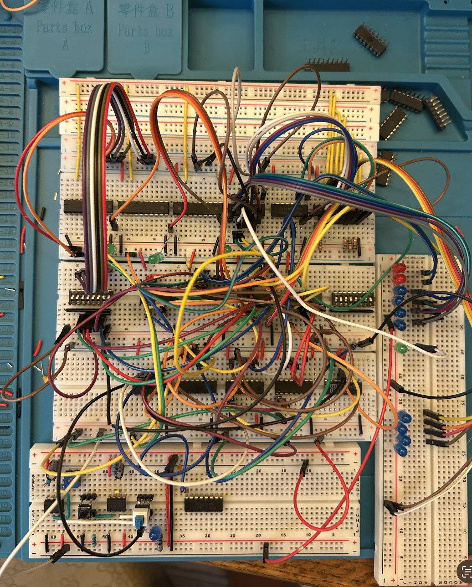

# TTL Logic Analyzer

Breadboard and PCB-based logic analyzer built from discrete 74xx TTL logic, SRAM, and multiplexed LED matrix displays.

## Overview
This project aims to build a fully discrete logic analyzer without using a microcontroller. The analyzer captures digital bus states into SRAM and displays captured samples on multiplexed LED matrices.

Project is currently in a state of active prototyping.

*This repository also contains a [closely related project](attiny-logic-analyzer) using an MCU-based design with 24 channels. 



## Features
- Fully TTL-based architecture
- SRAM-based sample capture
- Multiplexed LED matrix display
- External/internal clock modes
- Planned trigger and halt functionality
- Modular PCB-based design

## Current Status
Current prototype supports:
- 64ish x 8 sample memory subsystem
- LED matrix display driver
- Breadboard proof-of-concept testing

Known issues:
- Breadboard noise/signal integrity
- Clock edge instability
- Limited memory

## Architecture
Main subsystems:
- Capture memory subsystem
- Address/control logic
- Clock generation and edge conditioning
- Display subsystem

## Relevant Simulation Subcircuits
- `analyzer_7400.circ` — 74xx IC Implementation     
    - **mem_64x8**: Full memory subsystem test built from 74xx-style chips using four `ram_unit` subcircuits.
    - **ram_unit**: 16x8 RAM unit built from 74xx-style chips; used as the building block for `mem_64x8`.
    - **disp_16x16**: Limited-capacity display subsystem test; does not yet include the physical driver circuitry needed for hardware.
- `analyzer_ttl.circ` — Abstract Logic Implementation
    - **mem_64x8_async**: Asynchronous version of the 64x8 memory subsystem; same capacity as the final intended design.
    - **disp_16x32**: Full-capacity display subsystem test.

More detailed documentation:
- [Analyzer Architecture](docs/architecture.md)
- [Build Log](docs/build-log.md)
- [Simulation Subcircuits](simulations/sim-subcircuits.md)

## Repository Structure
```text
docs/                   Docs and architecture notes
images/                 Build photos and diagrams
pcb/                    KiCad PCB projects
simulations/            Logisim simulations
attiny-logic-analyzer/   Related MCU-based project
```

## Hardware
Main IC families/components:
- 74xx logic family chips
- ULN2803 and UDN2981

## Future Plans
- Expand memory depth
- Modular memory pcb
- Trigger logic
- Improved clock conditioning
- PCB-based final implementation

If the project expands beyond basic TTL hardware, plans may include
- USB interface
- OLED display
- Many more channels
- Higher sampling rate 

## License
MIT License