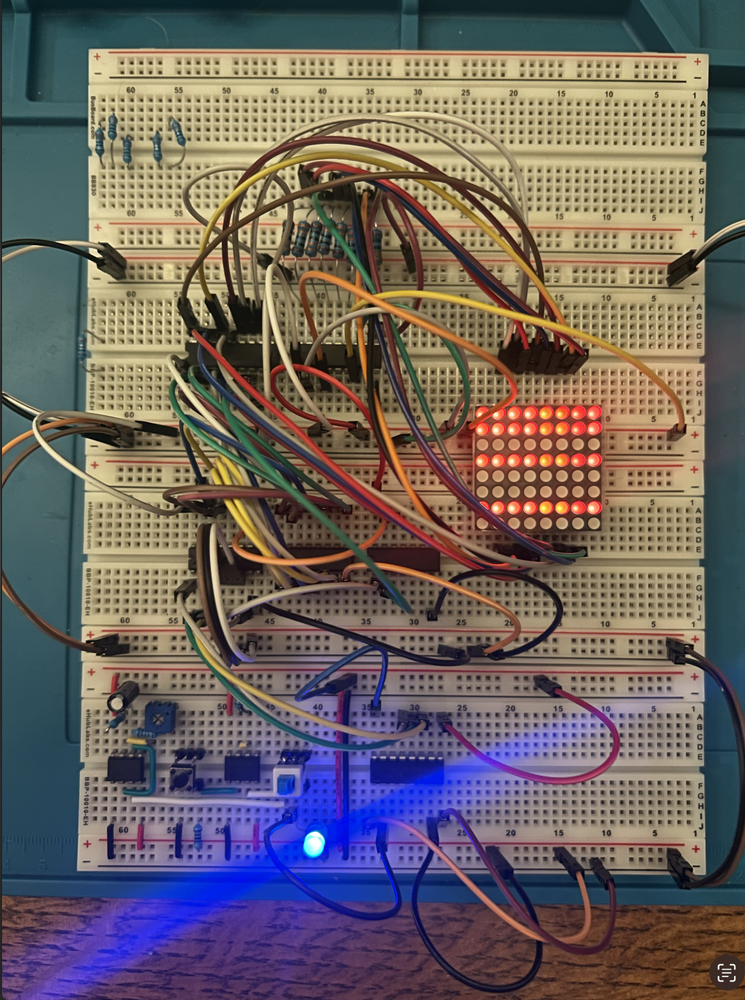
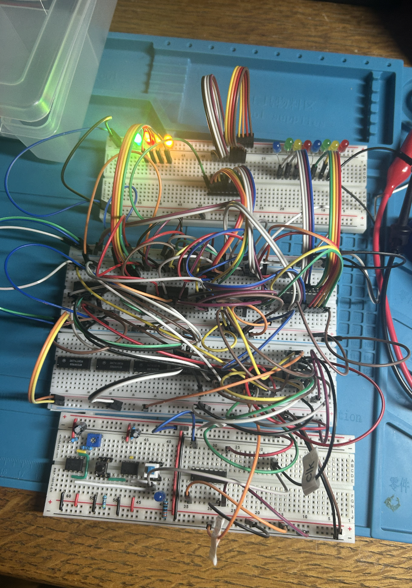
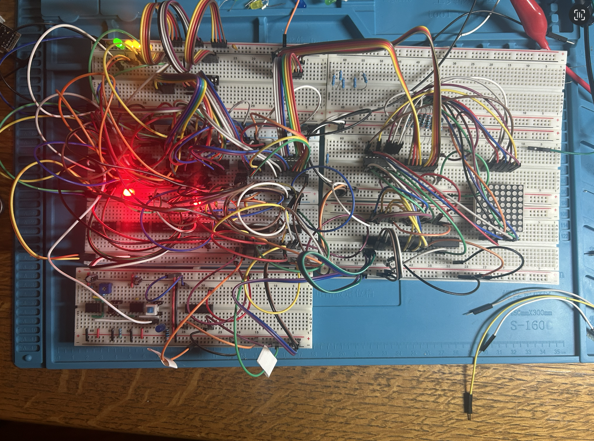

# TTL Logic Analyzer Build Log
## 5/22
Built bare minimum driver for a single 8x8 dot matrix as a test for display subsystem. 

Rows (matrix anodes) were driven by a high-sidedriver controlled by hardcoded inputs. A binary counter was connected to a 3-8 demultiplexer to select the active column, whose signal controlled a low-side driver. Driver output was connected via 330 ohm resistors to the columns (matrix cathodes).

Ben Eater's design of 555 timer-based clock module was used for incrementing the binary counter. 

Note: A `74LS138` was used as the demultiplexer since it was what was on hand, but it uses active low signalling so it effectively selects 7 columns at once. Its outputs were negated with 2 `74LS14` chips. A `74LS238` (active high) will be used in the future to improve the design.

___
### 8x8 Dot Matrix Driver

### Components
- 1 `UD2981` (high-side  driver)
- 1 `ULN2803` (low-side driver)
- 1 `74LS138` (3-8 demulitplexer) 
- 1 `74LS14` (hex inverter/schmitt trigger)
- 1 `74LS161` (binary counter)
- Too many 104 caps and 8x 330 ohm resistors

### Results/Future
- Good compatability between `UDN2981` and `ULN2803`
- Need polished [breadboard-compatible PCB](../pcb/8x8) for better breadboard prototyping
- Need to check scalability (final to have 8 total matrices)

## 5/23
Built 16x8 memory subsystem laid out in [simulation](../simulations/analyzer_7400.circ), though halt word enable system and RAM output inversions were omitted for simplicity.

**Design change #1**: `74LS245` tri-state buffer added to avoid having to build a 32-8 line multiplexer. Each RAM unit will have a buffer whos outputs are shared.

**Design change #2**: `74189` chips have open collector output (not consider in simulation), so 10k pull-up resistors were added.

**Design change #3**: Incoming clock signal had to be converted to rising edge via RC circuit (not considered in simulation). Implementing this meant passing the clock pulse through an RC circuit and into a schmitt trigger, effectively negating the clock pulse. The circuit had to be redesigned with this in mind.

**Potential design change**: D flip-flop might be completely unnecessary. Though in the original design it made for sample buffering (sampled data on the clock pulse when analyzer was halted), this may be removed entirely. It would make the system significantly more simple, and it makes sense to limit the number of samples given the already limited 64 sample memory.

**Design change updates reflected in current simulation as of _(5-27-2026)_**

___
### 16x8 Memory Subsystem

### Components
- 2 `74189` (RAM)
- 1 `74LS157` (2-1 multiplexer)
- 1 `74LS161` (binary counter)
- 1 `74LS279` (SR-latch)
- 1 `74LS74` (D flip-flop)
- 1 `74LS32` (OR gate)

After the memory subsystem was finished, it was connected to the matrix driver for a quick test. Its behavior was quite unpredictable, likely due to button debouncing and the edge detection circuit.

___
### 16x8 Memory Subsystem with Matrix Driver

### Results/Future
- Major noise despite a plethora of 104 caps. This size memory unit is probably the maximum that can be built on breadboards. Moving forward it will be done on modular PCBs. 
- Reconsider clock gating on RAM chips since 74xx they aren't meant for high frequency operations.
- Redesign simulation w/ design changes
- If simulation still works, rebuild the entire system (still only 16x8, but possibly with a "dummy" secondary RAM unit to test RAM unit selection). 

## 6/4
Built 64x8 memory subsystem laid out in [simulation](../simulations/analyzer_7400.circ).Only one memory unit was fully built: the other 3 were "dummy" units built with `74LS245`chips. Comparators and quad input AND gate were omitted for simplicity. 

The 6-bit **Address In** was represented by an 8-bit DIP switch pulled low by 5k ohm resistors connected to the `74LS157` chip inputs. The **Data In** bus was another 8-bit DIP switch pulled low by 5k ohm resistors connected directly to the RAM unit. The high 4 bits were connected to the first `74189` and the low 4 bits were connceted to the second. **HLT** and *RUN** were tied high and low with jumper wires for easy mode swaps. 

Ben Eater's design of 555 timer-based clock module was used as the clock input. Its output was inverted with the `74LS14` since the system is meant to run on the falling edge of clocks.

### Components
- 2 `74189` (RAM)
- 4 `74LS245` (tristate buffer)
- 2 `74LS157` (2-1 multiplexer)
- 2 `74LS161` (binary counter)
- 1 `74LS279` (SR-latch)
- 1 `74LS32` (OR gate)
- 1 `74LS14` (Schmitt trigger/NOT gate)

### Results/Future
The circuit didn't work. During read mode (SR latch set) counter data was correctly selected by the `74LS157` chips, but during write mode the **Address In** from the DIP switch was not correctly selected. The active address was shown as being all 1's no matter what. Using the multimeter, the problem was tracked to the output of the `74LS157` chips.

Data was not correctly written to the RAM. Data should have been written when inverted clock went low (while button of the clock module was pressed). After writing data, RAM address was manually selected with jumpers (since **Address In** was useless) and data was not being correctly represented from the `74LS245`.

Unsure what the cause of either issue is. Going to debug with a multimeter in coming days.

## 6/5
Debugged memory subsystem:
- Completely rewired RAM unit so only one RAM chip is connected to the system
- Replaced RAM inputs so they're hardcoded with jumper wires
- Confirmed `74189` chips work as expected (write when CS and WE are low)
- Used multimeter to check `74LS157` chips: found 5k resistors were too high -> replaced with 1k resistors -> fixed!
- Used multimeter to check outputs (side B) of `74LS245`: no output
- Hardcoded inputs (side A) of `74LS245`: found still no output
- RAM chips were fine: problem was the `74LS245`: pin 1 (`DIR`) was low but should have been high -> swapped jumper cable position -> fixed!

## New Ideas
- Give option for input clock being on rising edge too
- It's possible that when analyzer a target system, the channels will not register the highs and lows correctly (eg target system's high state is too low for the 74xx chip inputs): may need to use a sort of amplifier, or maybe PUD resistors will suffice

___
### 64x8 Memory Subsystem

### Results/Future
- Rewire disconnected RAM chip
- Rewire RAM inputs for testing
- Add word-based halting (comparators and quad input and gate)
- Thoroughly test entire circuit including tests with different clocks
- Build display subsystem

